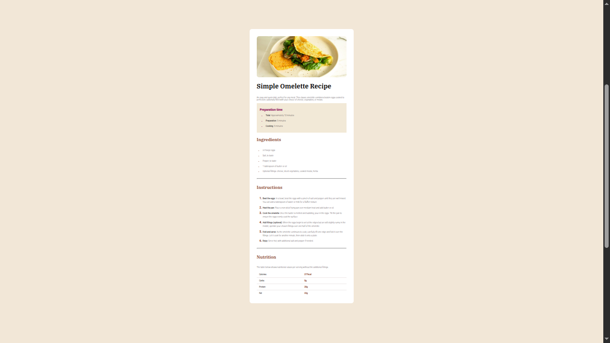

# Frontend Mentor - Recipe page solution

This is a solution to the [Recipe page challenge on Frontend Mentor](https://www.frontendmentor.io/challenges/recipe-page-KiTsR8QQKm).

## Table of contents

- [Overview](#overview)
  - [Screenshot](#screenshot)
  - [Links](#links)
- [My process](#my-process)
  - [Built with](#built-with)
- [Author](#author)

## Overview

### Screenshot

### Links

- Solution URL: [Solution URL](https://github.com/Vaishu229/Recipe-page)
- Live Site URL: [Live site URL](https://vaishu229.github.io/Recipe-page/)

## My process

### Built with

- Semantic HTML5 markup
- CSS custom properties
- Flexbox
- Desktop-first workflow

## Author

- Website - [Vaishnavi](https://github.com/Vaishu229)
- Frontend Mentor - [@Vaishu229](https://www.frontendmentor.io/profile/Vaishu229)
